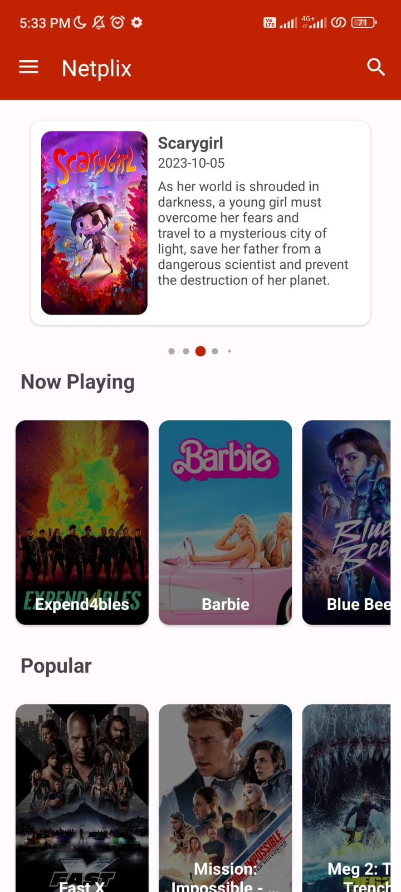
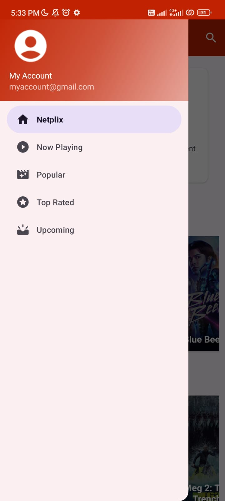
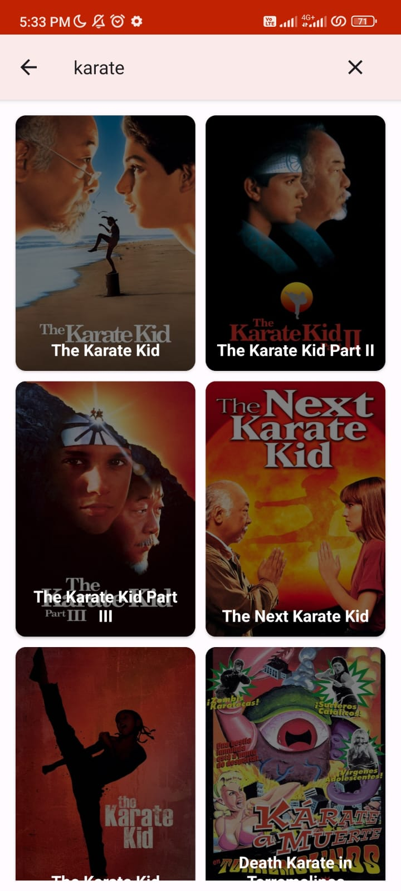
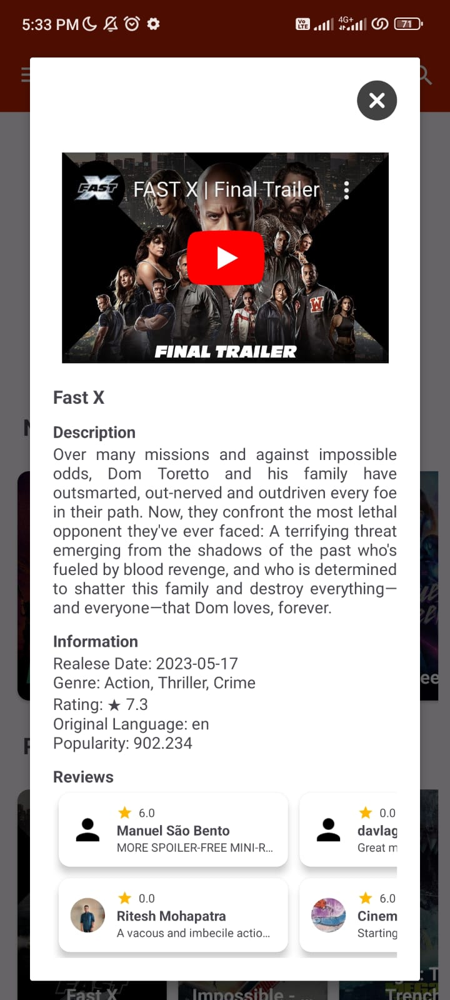
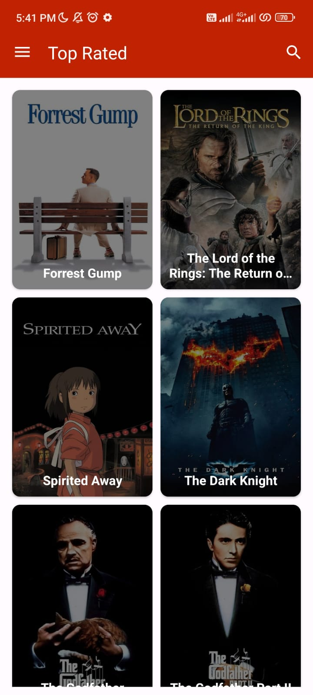

# Netplix

## Screenshot

  
  
  
  
  
  
  

API from [TheMovieDb](https://developers.themoviedb.org/3)

APK File [APK](https://drive.google.com/drive/folders/11HKqDYHYYMBw-TMm7KLFtTnGcE4n1eFG?usp=sharing)

## Features
- Get Movies (Trending,Now Playing, Popular, Top Rated, Upcoming)
- Search the Movies
- Detail Movie

## Tech Stack
- MVVM (Model-View-ViewModel) Architecture Pattern
- Modularization (core module)
- Clean Architecture (data, domain, presentation)
- Dependency Injection with Dagger Hilt
- Coroutines Flow
- ViewBinding
- Room DB
- Encryption with SQLCipher

## Dependencies
- [Glide](https://github.com/bumptech/glide)
- [Lottie](https://github.com/airbnb/lottie-android)
- [AndroidX](https://mvnrepository.com/artifact/androidx)
- [Lifecycle & LiveData](https://developer.android.com/jetpack/androidx/releases/lifecycle)
- [Dagger Hilt](https://dagger.dev/hilt/)
- [Retrofit](https://square.github.io/retrofit/)
- [Coroutines Flow](https://developer.android.com/kotlin/flow)
- [Room](https://developer.android.com/training/data-storage/room?gclid=Cj0KCQiA0MD_BRCTARIsADXoopYlw1cozWjwyR-ucLYa-aoqYlZeJmxG34JnhByjApMNwuchOcAzcy0aAgGHEALw_wcB&gclsrc=aw.ds)
- [SQLCipher](https://github.com/sqlcipher/sqlcipher)
- [SQLite](https://developer.android.com/jetpack/androidx/releases/sqlite)
- [Okhttp3](https://square.github.io/okhttp/)
- [scrollingpagerindicator](https://github.com/tinkoff-mobile-tech/ScrollingPagerIndicator)
- [Circle Image](https://github.com/hdodenhof/CircleImageView)
- [Timber](https://github.com/JakeWharton/timber)
